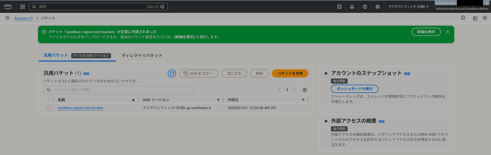
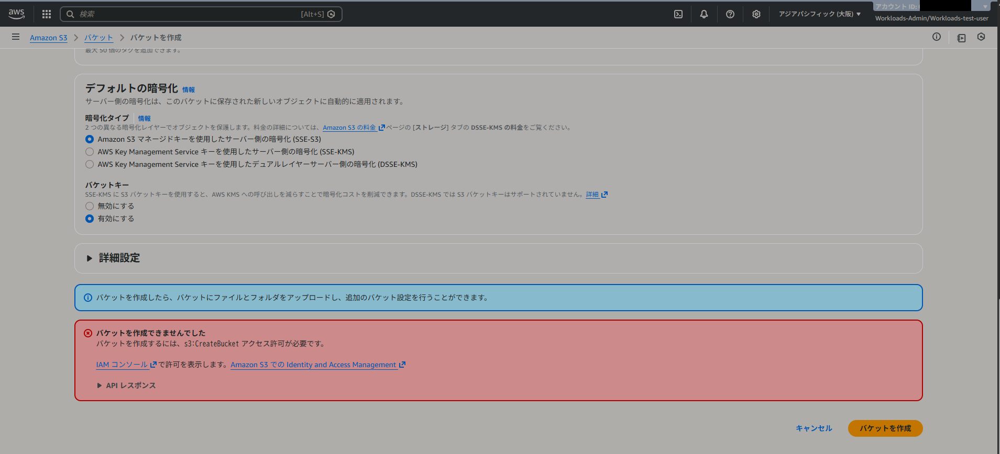
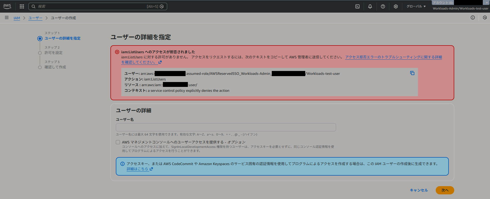
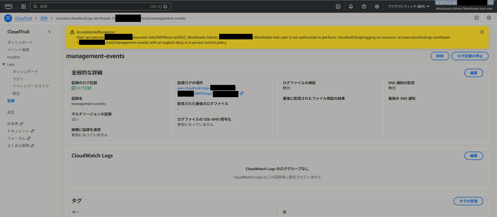
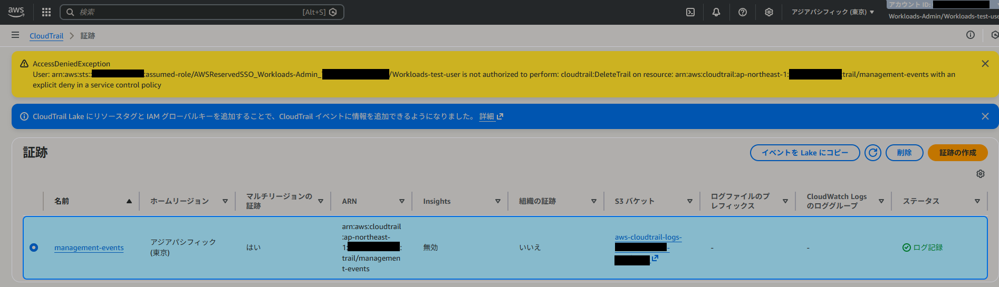
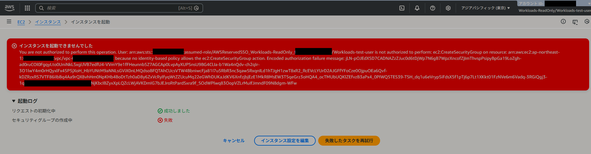

# AWS Organizations SCP Guardrails Portfolio

## 概要

本ポートフォリオは AWS Organizations 環境における  
Service Control Policy（SCP）を用いた  
**ガードレール設計**の実践記録です。

Sandbox 環境と Workloads 環境を分離し、  
本番運用を想定したセキュリティ制御を再現しています。

検証で証明した内容：

- SCPによるリージョン制御
- IAMユーザー作成禁止
- CloudTrailログ保護
- 管理者でも突破不可のガードレール

---

## 構成

```
Root
├── Sandbox OU
│   └── sandbox-test
│
└── Workloads OU
    ├── NonProduction
    │   └── workloads-test
    └── Production
```

---

## 適用SCP

| SCP名 | 目的 |
|------|------|
| Workloads-Deny-NonTokyo-Region | 東京リージョン以外の操作禁止 |
| Workloads-Deny-IAM-User-Operations | IAMユーザー作成禁止 |
| Workloads-Protect-Security-Logging | CloudTrailログ削除・停止防止 |

---

## 検証マトリクス

| 操作 | Sandbox | Workloads Admin | Workloads ReadOnly |
|------|--------|----------------|------------------|
| 大阪リージョンS3作成 | 成功 | 拒否 | 拒否 |
| IAMユーザー作成 | 成功 | 拒否 | 拒否 |
| CloudTrail停止 | 成功 | 拒否 | 拒否 |
| CloudTrail削除 | 成功 | 拒否 | 拒否 |
| EC2インスタンス作成 | 成功 | 成功 | 拒否 |

---

## エビデンス

### Sandbox：リージョン制御成功


### Workloads：リージョン制御拒否


### IAMユーザー作成拒否


### CloudTrail停止拒否


### CloudTrail削除拒否


### ReadOnly EC2作成拒否


---

## 設計思想

- Guardrail first
- 管理者権限の過信禁止
- ログの不可逆保護

Organizationsレベルで制御することで  
IAM設定を突破しても影響を受けない構造を実現。

---

## 設計・検証を通じて確認したこと

- SCP は許可を与える仕組みではなく、
  OU 配下アカウントに対して
  「実行可能な操作の上限」を定義するガードレールとして機能することを、
  実際の操作検証を通じて確認した

- SCP による明示的 Deny は、
  IAM ポリシーや Permission Set による許可を含め、
  管理者権限であっても例外なく上書きされることを、
  管理者ロールでの操作失敗により検証した

- IAM Identity Center の Permission Set による権限設計を行っても、
  Organizations レベルでの SCP 設計が不十分な場合、
  想定外の操作が可能となることを確認した

- 個別ユーザーやロールの権限設計だけでなく、
  OU 構成と SCP による制御を含めた
  組織設計そのものがセキュリティベースラインの中核になることを、
  複数パターンの検証を通じて整理した


---

## 結論

本ポートフォリオでは、AWS Organizations 配下において、
SCP を用いたガードレール設計と
IAM Identity Center の Permission Set による権限管理を組み合わせることで、

「個別の権限設計に依存せず、
組織レベルでセキュリティベースラインを強制できる構成」

が実際の操作レベルで成立することを検証した。

検証の結果、
IAM ポリシーや Permission Set による制御だけでは、
管理者権限を含む過剰な操作を完全に防ぐことはできず、
Organizations レベルでの SCP 設計が
セキュリティの前提条件となることを確認した。

本構成により、
権限設計のばらつきや人為的ミスに左右されない
一貫したガードレールを提供できると判断した。

